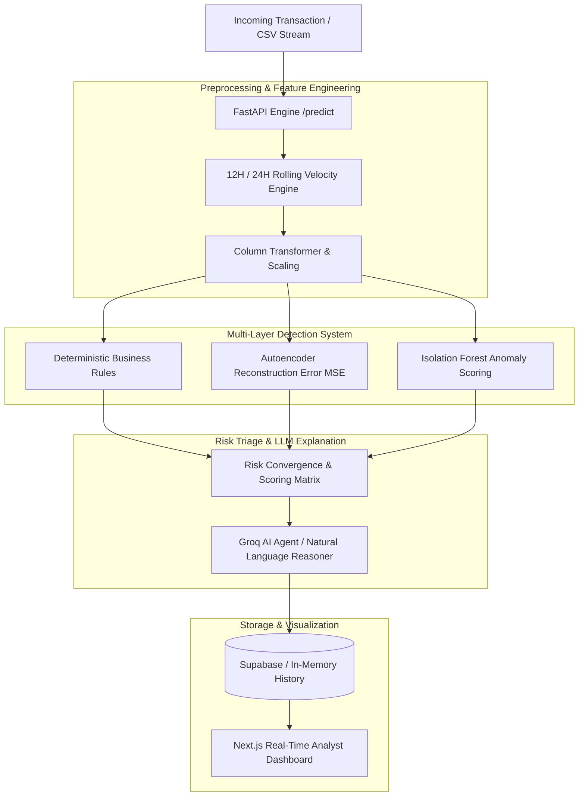

# Real-Time Financial Fraud & Velocity Analytics Engine

A production-grade, hybrid financial fraud detection and risk triage platform combining **deterministic business rules**, **hybrid unsupervised machine learning (Autoencoder + Isolation Forest)**, and **Groq AI-powered natural language explanations** with a modern **Next.js Real-time Analyst Dashboard**.

---

## Architecture Overview



---

## Key Features

- **Multi-Layer Detection Stack:**
  - **Deterministic Rules Engine:** Catches velocity spikes, high-frequency transactions within 12h/24h windows, balance mismatches, and multiple failed login attempts.
  - **Autoencoder Neural Network:** Measures non-linear reconstruction deviation (MSE) to detect unusual multivariate patterns.
  - **Isolation Forest:** Tree-based anomaly isolation for outlier identification across transaction attributes.
- **Natural Language Risk Explanations (Groq AI):**
  - Converts complex anomaly metrics into clear, human-understandable, 1–2 sentence explanations for everyday banking staff and customers.
  - Explains real-world drivers (e.g., sudden amount surge, rapid succession purchases, multiple failed logins) without confusing ML jargon.
- **Interactive Next.js Dashboard:**
  - Real-time transaction live feed with automated polling.
  - Risk categorization: `CRITICAL`, `HIGH`, `MEDIUM`, and `LOW`.
  - Manual single-transaction audit modal with instant AI risk triage.
  - Bulk CSV transaction dataset upload & analysis.
  - Visual metrics: Velocity trends, anomaly distribution, and account search.
- **Optional Supabase Cloud Integration:**
  - Automatic persistence to cloud database with seamless in-memory fallback for local development.

---

## Tech Stack

- **Backend:** Python 3.10+, FastAPI, Uvicorn, Pandas, NumPy, Scikit-learn, Joblib
- **LLM & AI:** Groq AI API (`groq/compound-mini`)
- **Frontend:** Next.js 15, React 19, TypeScript, Tailwind CSS, Lucide React, Recharts
- **Database:** Supabase PostgreSQL (optional) / In-Memory caching

---

## Project Structure

```
npnfraud/
├── main.py                         # FastAPI backend & ML triage pipeline
├── requirements.txt                # Python dependencies
├── .env.example                    # Environment variables template
├── bank_transactions_data_2.csv   # Sample transaction dataset
├── models/                         # Pretrained ML artifacts
│   ├── autoencoder_model.joblib    # Autoencoder neural network
│   ├── isolation_forest_model.joblib # Isolation Forest model
│   └── preprocessor.joblib         # Data scaler & categorical encoder
└── fraud-dashboard/                # Next.js frontend application
    ├── app/                        # Next.js App Router pages
    ├── components/                 # React UI components & Dashboard
    ├── package.json                # Frontend dependencies
    └── tsconfig.json               # TypeScript configuration
```

---

## Getting Started

### 1. Prerequisites
- **Python 3.10+** installed
- **Node.js 18+** and **npm** installed
- *(Optional)* [Groq API Key](https://console.groq.com) for AI explanations
- *(Optional)* [Supabase Project](https://supabase.com) for cloud persistence

---

### 2. Environment Configuration

Create a `.env` file in the root directory:
```bash
cp .env.example .env
```

Configure your `.env` file:
```env
# Optional: Groq AI for natural language explanations
GROQ_API_KEY=your_groq_api_key_here

# Optional: Supabase for persistent cloud history
SUPABASE_URL=https://your-project.supabase.co
SUPABASE_KEY=your_supabase_anon_key_here
```

---

### 3. Backend Setup (FastAPI)

1. Open a terminal in the project root:
   ```bash
   # Install Python dependencies
   pip install -r requirements.txt

   # Start the FastAPI server
   py -m uvicorn main:app --reload --port 8000
   ```
2. The backend will be live at:
   - **API Server:** `http://localhost:8000`
   - **Interactive Swagger Docs:** `http://localhost:8000/docs`
   - **Health Check:** `http://localhost:8000/health`

---

### 4. Frontend Setup (Next.js Dashboard)

1. Open a second terminal and navigate to `fraud-dashboard`:
   ```bash
   cd fraud-dashboard

   # Install frontend dependencies
   npm install

   # Start the Next.js development server
   npm run dev
   ```
2. Open your browser and navigate to:
   - **Dashboard UI:** `http://localhost:3000`

---

## API Endpoints Reference

| Method | Endpoint | Description |
|---|---|---|
| `GET` | `/health` | System status, loaded ML models, and Groq/Supabase connectivity |
| `POST` | `/predict` | Single transaction real-time scoring, rule check, and Groq explanation |
| `POST` | `/batch-predict` | Upload a CSV file of transactions for batch ML triage |
| `GET` | `/history` | Retrieve recent transaction logs with risk scores and explanations |
| `GET` | `/stream` | Real-time simulated transaction event stream for live monitoring |

---

## Sample Single Transaction Request (`POST /predict`)

```json
{
  "TransactionID": "TXN_9921",
  "AccountID": "ACC_4402",
  "TransactionAmount": 14200.00,
  "TransactionDuration": 45.0,
  "LoginAttempts": 3,
  "AccountBalance": 15000.00,
  "TransactionType": "Transfer",
  "Channel": "Online",
  "CustomerOccupation": "Business",
  "Txn_Count_12H": 5,
  "Txn_Sum_24H": 28400.00
}
```

### Sample Response:
```json
{
  "transaction_id": "TXN_9921",
  "account_id": "ACC_4402",
  "amount": 14200.0,
  "is_fraud": true,
  "risk_level": "CRITICAL",
  "isolation_score": 0.7321,
  "autoencoder_mse": 1.4892,
  "ai_explanation": "Anomaly detected: An unusually large transaction of $14,200 along with multiple rapid transfers and 3 failed login attempts within 12 hours differs significantly from normal account activity."
}
```

---

## Contributing & License

This project is built for educational and financial security research. Contributions and issues are welcome via pull requests!
