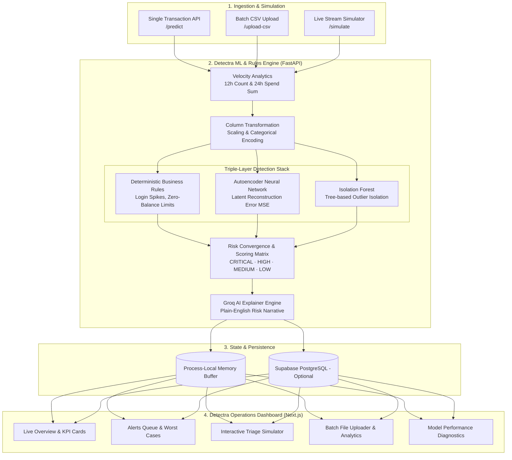

# 🛡️ Detectra: Real-Time Fraud Operations & Intelligence Console

[](https://baf-detectra.vercel.app/)
[](https://npnfraud-tk.onrender.com/docs)
[](https://python.org)
[](https://fastapi.tiangolo.com)
[](https://nextjs.org)
[](https://typescriptlang.org)

**Detectra** is a real-time financial fraud detection and operations platform. It combines **instant business rule checks**, **advanced unsupervised machine learning (Neural Network Autoencoder + Isolation Forest)**, and **Groq AI natural-language explanations** with an intuitive **Next.js operations console**.

---

## 🌟 What is Detectra in Plain English?

Imagine an airport security scanner for bank transactions. Every time someone makes a payment, transfers money, or logs into their account:

1. **Rule Checker (Instant Gate):** Detectra immediately checks basic safety rules (e.g., *Is the customer trying to transfer more money than they actually have? Were there 5 failed password attempts in 2 minutes?*).
2. **AI Pattern Scanner (Unsupervised ML):** Detectra compares the transaction against typical customer behavior to spot hidden, complex fraud patterns that human rules might miss.
3. **AI Analyst Copilot (Groq LLM):** Instead of just giving a confusing score like `0.872`, Detectra's AI automatically writes a clear 1-to-2 sentence explanation in plain English (e.g., *"Unusual $14,500 transfer accompanied by 4 failed password attempts and a sudden 12-hour velocity surge"*).
4. **Operations Console:** Bank analysts and risk officers see live incoming transactions, investigate high-risk alerts, test "what-if" transaction simulations, and upload bulk CSV batches for instant auditing.

---

## 🏗️ System Architecture



---

## 🔍 How Each Component Works

### 1. Velocity & Behavioral Feature Engineering
* **What it does:** Tracks how fast money is moving and how frequently transactions occur for a given account over 12-hour and 24-hour windows.
* **Why it matters:** A single $200 purchase might look normal, but 10 separate $200 purchases in 15 minutes is a classic sign of a stolen card or automated bot attack.

### 2. Deterministic Business Rules
* **What it does:** Evaluates hard threshold conditions immediately upon transaction arrival.
* **Key Rules Evaluated:**
  * **Zero/Low Balance Exhaustion:** Transaction amounts exceeding 95% of current account balance.
  * **Brute-Force Detection:** More than 3 failed login attempts prior to a payment.
  * **Unusual Transaction Duration:** Transactions executed abnormally fast (< 5 seconds) or stalling.
  * **Transfer Surges:** High-value wire transfers from previously dormant channels.

### 3. Autoencoder Neural Network (Reconstruction Error)
* **What it does:** An unsupervised deep learning model trained on legitimate banking patterns. It compresses the transaction data into a condensed latent representation and reconstructs it.
* **How it flags fraud:** When presented with normal traffic, the reconstruction error (Mean Squared Error - MSE) is very low. When an abnormal or fraudulent transaction arrives, the network fails to reconstruct it accurately, resulting in a high MSE spike.

### 4. Isolation Forest (Tree-Based Anomaly Isolation)
* **What it does:** Builds random decision trees to isolate anomalies.
* **How it flags fraud:** Outliers and fraudulent records require very few decision splits to isolate compared to normal points that sit clustered together deep within the tree structure.

### 5. Groq AI Natural Language Explanations
* **What it does:** When an alert is triggered (`CRITICAL` or `HIGH`), Detectra passes the triggered rules, anomaly scores, and transaction details to Groq LLM (`llama-3.1-8b-instant`).
* **Output:** Generates clear, actionable sentences with zero technical jargon so frontline bank staff can take immediate action (e.g., block the card, phone the customer, or approve the payment).

### 6. Mathematical Model Validation
Detectra is continuously validated against quantitative unsupervised benchmarks:
* **Silhouette Separability Score (`0.5915`):** Proves mathematically that normal transactions form a tight, cohesive group while fraud anomalies are separated into distinct outer clusters.
* **Contamination Rate Stability (`0.79%`):** Calibrated to maintain a realistic operational target (~1.00%), ensuring human fraud teams do not suffer from alert fatigue.

---

## 🖥️ Real-Time Console Pages (`fraud-dashboard`)

| Page | Purpose & Capabilities |
| :--- | :--- |
| **📊 Overview** | Live pulse of the operations book: value at risk, needs-review queue, scored volume, and velocity charts. |
| **🚨 Alerts** | Prioritized triage queue showing highest-risk cases first with one-click decision workflows. |
| **📑 Transactions** | Filterable, searchable live ledger of all scored transactions with multi-column sorting. |
| **👤 Accounts** | Account-level rollups aggregating historical risk exposure, total flagged events, and primary channels. |
| **⚡ Simulator** | Interactive "what-if" testing tool to construct custom scenarios and inspect live AI risk ratings in real time. |
| **📂 Batch Upload** | Drag-and-drop CSV batch upload for instant mass scoring with live progress metrics. |
| **🧠 Models** | Diagnostic panel detailing silhouette scores, contamination stability, and loaded model artifacts. |
| **⚙️ Settings** | Console configuration, polling intervals, connected backend health status, and synthetic buffer management. |

---

## 🚀 Live Demo Links

* **Frontend Dashboard (Next.js):** [https://baf-detectra.vercel.app/](https://baf-detectra.vercel.app/)
* **Backend API Documentation (Swagger):** [https://npnfraud-tk.onrender.com/docs](https://npnfraud-tk.onrender.com)

---

## 🛠️ Quickstart: Running Locally

### 1. Prerequisites
* **Python 3.10+**
* **Node.js 18+** & **npm**
* *(Optional)* [Groq API Key](https://console.groq.com) for AI explanations
* *(Optional)* [Clerk Account](https://clerk.com) for user authentication

---

### 2. Backend Setup (FastAPI)

```bash
# 1. Clone the repository
git clone https://github.com/TharsanKanthaswamy/BAF.git
cd BAF

# 2. Install Python dependencies
pip install -r requirements.txt

# 3. Create .env file (Optional: add your GROQ_API_KEY)
cp .env.example .env

# 4. Start the FastAPI server
uvicorn main:app --reload --port 8000
```
* Backend API: `http://localhost:8000`
* Interactive API Docs: `http://localhost:8000/docs`

---

### 3. Frontend Setup (Next.js Console)

```bash
# 1. Navigate to the dashboard directory
cd fraud-dashboard

# 2. Install dependencies
npm install

# 3. Configure environment variables (optional for local dev)
# Default points to http://localhost:8000 if not specified
cp .env.example .env.local

# 4. Start the development server
npm run dev
```
* Open your browser at: `http://localhost:3000`

---

## 📡 API Reference Summary

| Method | Route | Description |
| :--- | :--- | :--- |
| `GET` | `/health` | Live health status, loaded ML model indicators, and DB connection state. |
| `GET` | `/metrics` | Unsupervised mathematical metrics (Silhouette score, contamination rate). |
| `GET` | `/history` | Returns the retained transaction buffer with newest transactions first. |
| `POST` | `/predict` | Scores a single transaction with rules, ML models, and LLM reasoning. |
| `POST` | `/upload-csv` | Processes a bulk CSV file and returns batch risk metrics. |
| `POST` | `/simulate` | Injects synthetic transactions into the live stream to test the alerts pipeline. |
| `POST` | `/history/delete` | Purges selected transactions or origin sources (e.g., simulation data). |
| `DELETE`| `/history` | Completely resets the in-memory transaction buffer. |

---

## 📋 Sample Prediction Request

**`POST /predict`**
```json
{
  "TransactionID": "TXN_88421",
  "AccountID": "ACC_4091",
  "TransactionAmount": 16500.00,
  "AccountBalance": 12000.00,
  "LoginAttempts": 4,
  "TransactionDuration": 15.0,
  "TransactionType": "Transfer",
  "Channel": "Online",
  "CustomerOccupation": "Business",
  "Txn_Count_12H": 6,
  "Txn_Sum_24H": 33000.00
}
```

**Response (`200 OK`):**
```json
{
  "transaction_id": "TXN_88421",
  "account_id": "ACC_4091",
  "amount": 16500.0,
  "is_fraud": true,
  "risk_level": "CRITICAL",
  "isolation_score": 0.7482,
  "autoencoder_mse": 1.5124,
  "source": "manual",
  "ai_explanation": "Critical Risk: An unusually large transfer of $16,500 exceeding the account balance ($12,000) was requested following 4 failed login attempts and a rapid surge in 12-hour velocity."
}
```

---

## 📄 License & Attribution

Developed for financial risk research and modern operations intelligence. Contributions, bug reports, and suggestions are welcome via issues and pull requests!
